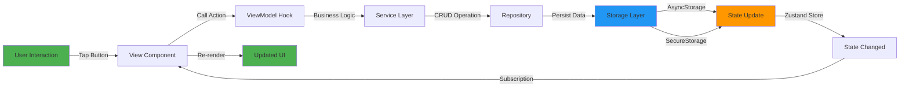
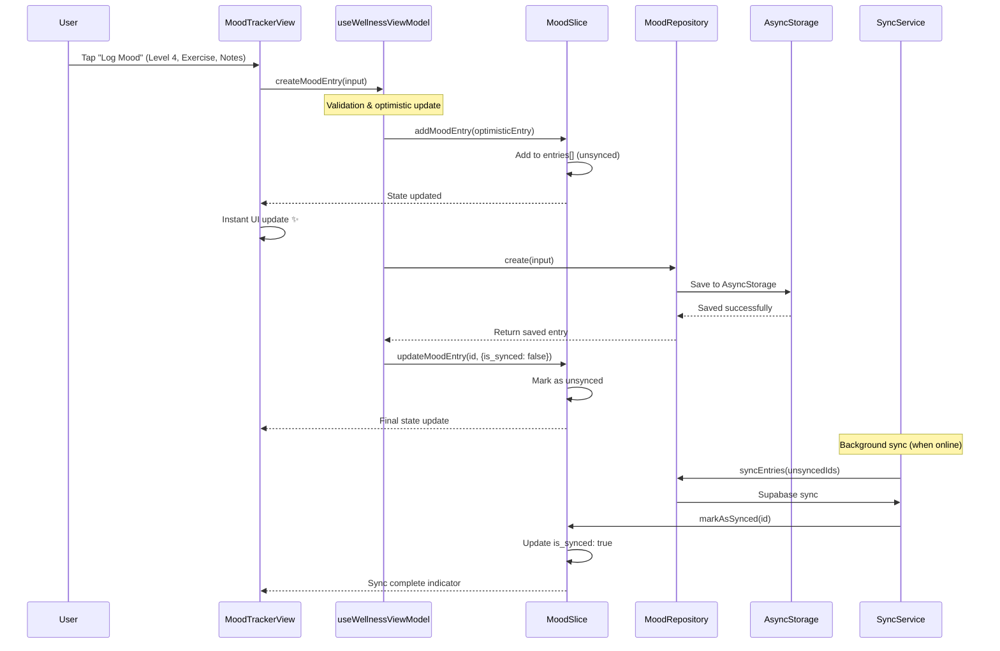
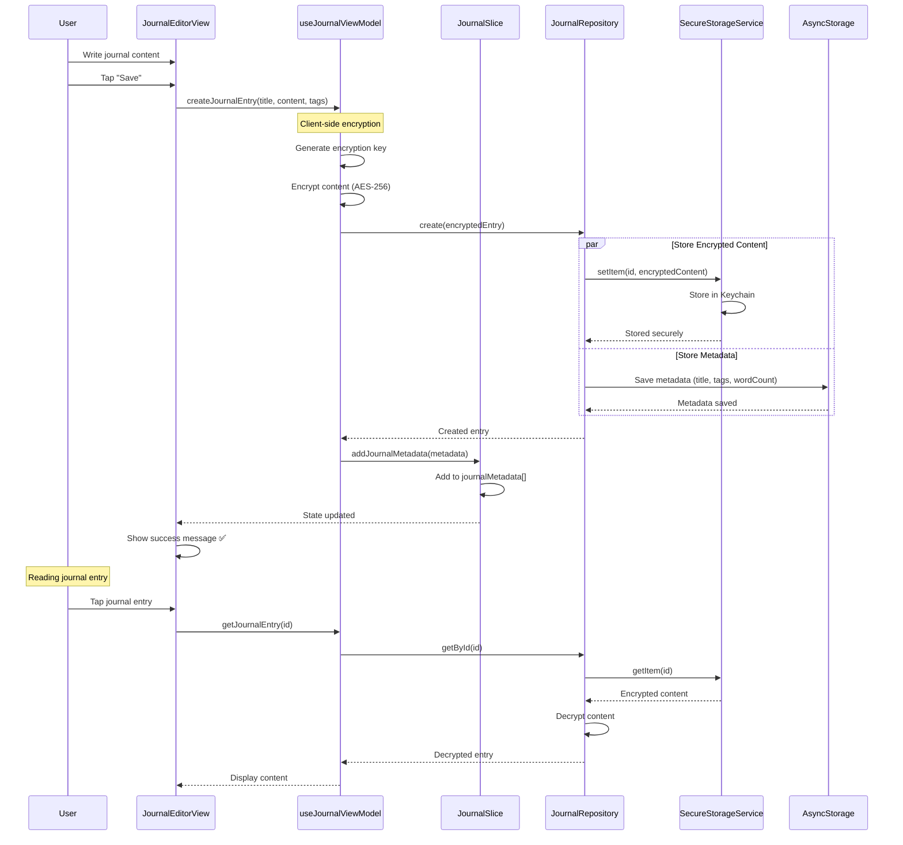
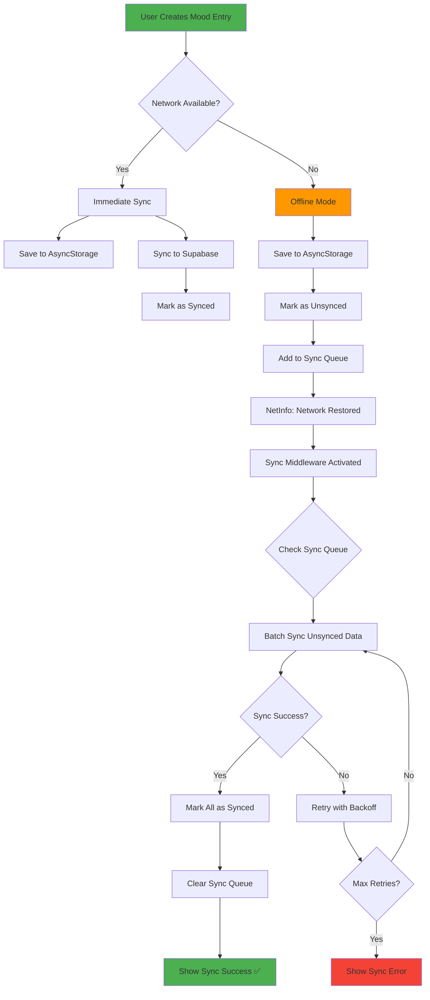
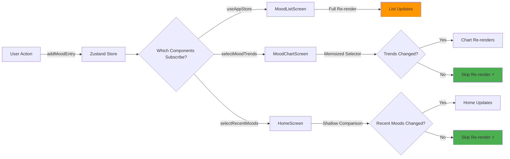
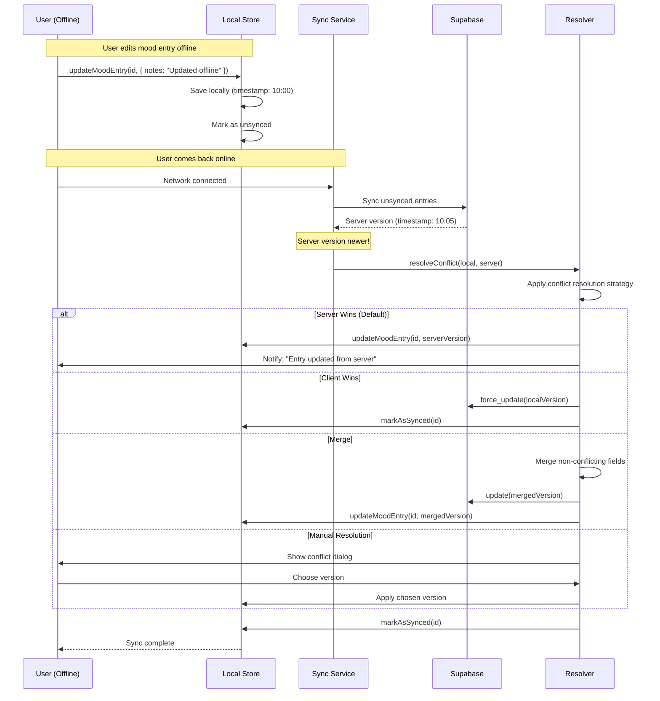
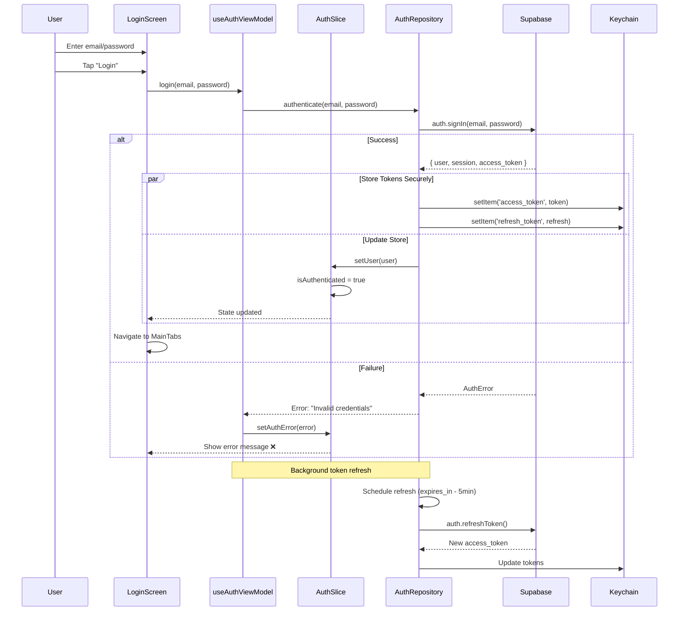
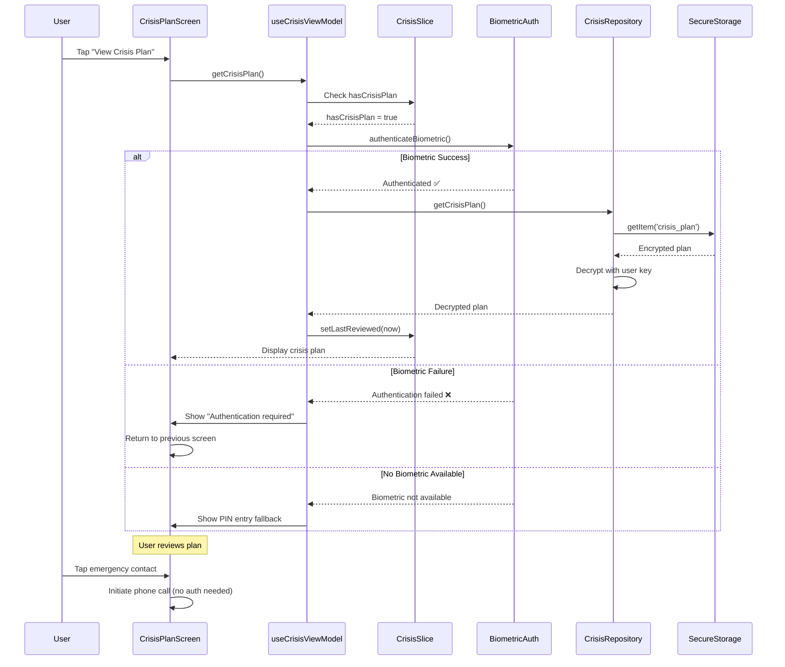

# Rediscover Talk - Data Flow Diagrams

**Version**: 1.0.0
**Architecture**: MVVM-C with Zustand State Management
**Framework**: LitmonCloud Mobile Development Framework v3.1

---

## Table of Contents

1. [Unidirectional Data Flow](#unidirectional-data-flow)
2. [Mood Entry Creation Flow](#mood-entry-creation-flow)
3. [Journal Entry Encryption Flow](#journal-entry-encryption-flow)
4. [Offline-First Sync Flow](#offline-first-sync-flow)
5. [State Update Propagation](#state-update-propagation)
6. [Conflict Resolution Flow](#conflict-resolution-flow)
7. [Authentication Flow](#authentication-flow)
8. [Crisis Plan Access Flow](#crisis-plan-access-flow)

---

## Unidirectional Data Flow

**Pattern**: View → ViewModel → Service → Repository → Storage → State Update → View Refresh



**Key Principles**:
- Data flows in **one direction only**
- State updates trigger **automatic re-renders**
- No direct state manipulation from views
- All mutations go through **actions**

---

## Mood Entry Creation Flow

**Scenario**: User creates a new mood entry with activities and notes



**Timeline**:
1. **0ms**: User taps button
2. **~50ms**: Optimistic update → UI shows new entry immediately
3. **~100ms**: AsyncStorage save completes
4. **~1000ms**: Background sync to Supabase (if online)

**Error Handling**:
- If AsyncStorage fails → Rollback optimistic update
- If sync fails → Retry with exponential backoff
- User sees sync status indicator (syncing, synced, error)

---

## Journal Entry Encryption Flow

**Scenario**: User creates encrypted journal entry



**Security Layers**:
1. **Client-side encryption** before persistence
2. **AES-256** encryption standard
3. **Keychain storage** (OS-level security)
4. **Biometric authentication** required for access
5. **Auto-lock** after inactivity

**Metadata vs Content**:
- **Metadata** (AsyncStorage): `{id, title, tags, wordCount, created_at}`
- **Content** (SecureStorage): Encrypted full journal text

---

## Offline-First Sync Flow

**Scenario**: User creates data offline, then comes back online



**Sync Queue Management**:
```typescript
{
  unsyncedEntries: ['mood-1', 'mood-2'],
  unsyncedJournals: ['journal-1'],
  unsyncedResponses: ['prompt-1'],
  pendingChanges: 4
}
```

**Backoff Strategy**:
- Attempt 1: Immediate
- Attempt 2: +2 seconds
- Attempt 3: +4 seconds
- Attempt 4: +8 seconds (max)
- Then: Manual retry or wait for next sync interval

---

## State Update Propagation

**Scenario**: State change triggers component re-renders



**Optimization Techniques**:

1. **Selector Subscriptions** (Prevent Unnecessary Re-renders)
   ```typescript
   // ✅ Only re-renders when trends change
   const trends = useAppStore(selectMoodTrends);
   ```

2. **Shallow Comparison**
   ```typescript
   // ✅ Only re-renders if user OR preferences change
   const { user, preferences } = useAppStore(
     state => ({ user: state.user, preferences: state.preferences }),
     shallow
   );
   ```

3. **Memoized Selectors**
   ```typescript
   // ✅ Calculation cached, not recomputed on every render
   export const selectMoodTrends = (state) => {
     return expensiveCalculation(state.entries);
   };
   ```

---

## Conflict Resolution Flow

**Scenario**: User edits mood entry offline, server has newer version



**Conflict Resolution Strategies**:

1. **Server Wins (Default)** - Mental health data prioritizes latest clinical state
2. **Client Wins** - User explicitly forces local changes
3. **Merge** - Non-conflicting fields merged (e.g., tags + notes)
4. **Manual** - Critical data (crisis plan) requires user decision

**Supabase RLS Conflict Detection**:
```sql
-- Detect conflicts via updated_at timestamp
SELECT * FROM mood_entries
WHERE id = $1 AND updated_at > $2;
```

---

## Authentication Flow

**Scenario**: User logs in with email/password



**Token Management**:
- **Access Token**: Keychain (OS-encrypted)
- **Refresh Token**: Keychain (OS-encrypted)
- **User Profile**: AsyncStorage (non-sensitive)
- **Session State**: Zustand Store (in-memory)

**Security**:
- Tokens never persisted in AsyncStorage
- Auto-refresh 5 minutes before expiry
- Logout clears both stores and Keychain

---

## Crisis Plan Access Flow

**Scenario**: User accesses encrypted crisis plan



**Access Control**:
1. **Biometric Required**: Face ID / Touch ID / Fingerprint
2. **Fallback**: 4-digit PIN (if biometric unavailable)
3. **Emergency Access**: Direct dial without auth
4. **Auto-Lock**: Re-auth after 5 minutes inactivity

**Crisis Plan Structure**:
```typescript
{
  encrypted_warning_signs: string,      // AES-256 encrypted
  encrypted_coping_strategies: string,  // AES-256 encrypted
  encrypted_support_contacts: string,   // AES-256 encrypted
  emergency_instructions: string,       // Plaintext (for quick access)
  last_reviewed_at: Date                // Metadata in store
}
```

---

## Summary

**Data Flow Principles**:
✅ **Unidirectional**: View → ViewModel → Service → Repository → Store → View
✅ **Optimistic Updates**: Instant UI feedback with rollback on failure
✅ **Offline-First**: Local persistence with background sync
✅ **Security**: Multi-layer encryption for sensitive data
✅ **Performance**: Selector optimization prevents unnecessary re-renders
✅ **Reliability**: Exponential backoff retry logic for sync failures

**Next Steps**: See `STATE_MANAGEMENT_GUIDE.md` for implementation details and `BACKEND_INTEGRATION.md` for Supabase sync patterns.
